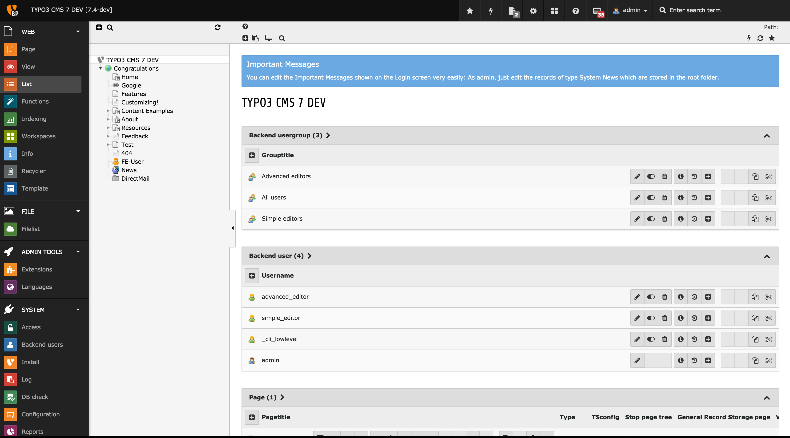
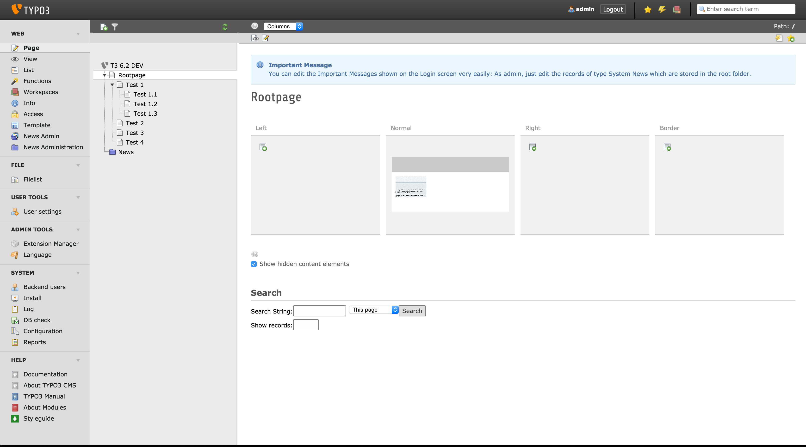

TYPO3 CMS Extension "extended_sys_news"
=======================================
This extension add an additional setting for ``sys_news``, which make it possible to render a system news as FlashMessage in backend.
it is very useful if you plan a release and want your editors keep informend about the upcoming release.

Screenshot
----------

.. figure:: Resources/Public/Documentation/sys_news_extended.png
    :alt: New setting for system news

Requirements
------------
- TYPO3 CMS 6.2+

Installation & Configuration
----------------------------
The extension just needs to be installed as any other extension:

* Install it from TER_
* Install it by download the ZIP_ or TAR_

Message types
^^^^^^^^^^^^^

You can choose one of five message types:

* Notice
* Information
* Success
* Warning
* Error

.. _TER: http://typo3.org/extensions/repository/view/extended_sys_news
.. _ZIP: https://github.com/NeoBlack/ExtendedSysNews/archive/v1.0.0.zip
.. _TAR: https://github.com/NeoBlack/ExtendedSysNews/archive/v1.0.0.tar.gz
